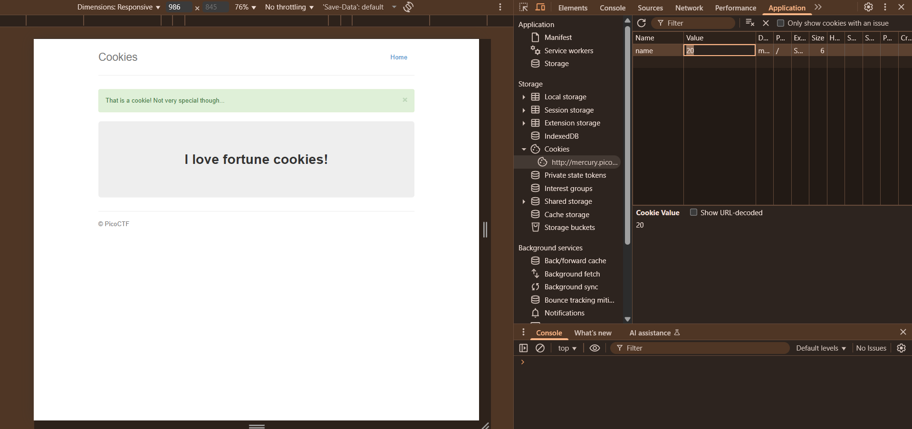

# Cookies

### Objective:

Who doesn't love cookies? Try to figure out the best one. `http://mercury.picoctf.net:6418/`
Hint: (None)

### Commands / Steps:

Step 1: Visit the website.

Step 2: We inspect the page. 

Step 3: There wasn't much information to find in the 'Elements' tab.

Step 4: We go to 'Network' tab to read the find clues in the headers. 

Step 5: We will try with different cookies. Look at the request headers — we will see a Cookie header with a name=value pair.

Step 6: Then, we can go to the 'Application' tab - cookies section. We manually change the cookie value. Refresh the page after each change and watch the response. After several attempts, one of the cookie values will reveal the flag.

### Flag:

> picoCTF{3v3ry1_l0v3s_c00k135_88acab36}

### Notes / Tips

- You can solve this manually via browser developer tools, but BurpSuite Intruder makes it faster for large ranges.

