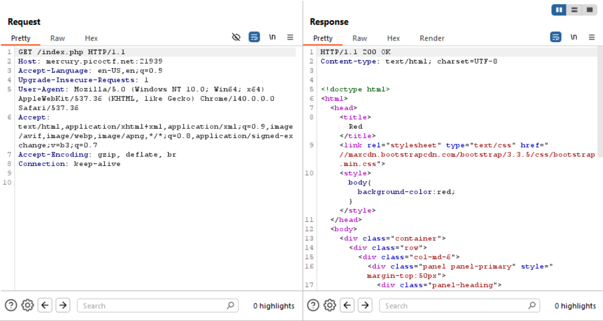
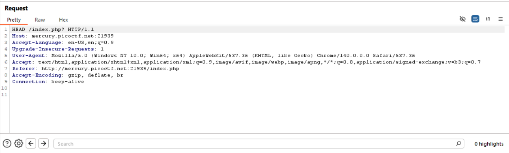

# GET aHEAD

### Objective:

Find the flag being held on this server to get ahead of the competition `http://mercury.picoctf.net:21939/`
Hint1: Maybe you have more than 2 choices
Hint2: Check out tools like Burpsuite to modify your requests and look at the responses

### Commands / Steps:

Step 1: We will visit the link in our browser first. 

Step 2: Let's check the responses in burpsuite since the hint tells us to. 

Step 3: We go to the 'proxy' tab of burpsuit and open browser. We enter the link - http://mercury.picoctf.net:21939/ - which we need to inspect. 

Step 4: Then we go to the 'target' tab beside 'proxy' tab to check what responses we get when we click the buttons on the page. 

Step 5: The responses are as in the photo below. 

Step 6: There's nothing interesting regarding flag in the responses if we click the buttons. 

Step 7: The name of the challenge looks interesting though. In "GET aHEAD", both GET and HEAD are Http methods. So maybe we can try modifying it. 

Step 8: In 'proxy' tab of burpsuite, we can try modifying the header of the request like in the photo below. 

Step 9: Then we forward the request and check the response in the 'target' tab. There we will get a flag in the response. 

### Flag:

> picoCTF{r3j3ct_th3_du4l1ty_6ef27873}

### Notes / Tips

- GET → retrieves both headers and body of a resource.

- HEAD → retrieves only headers (no body), but servers may include extra info (like hidden flags).

- This challenge is a good intro to exploring HTTP verbs and Burp Suite Repeater.

