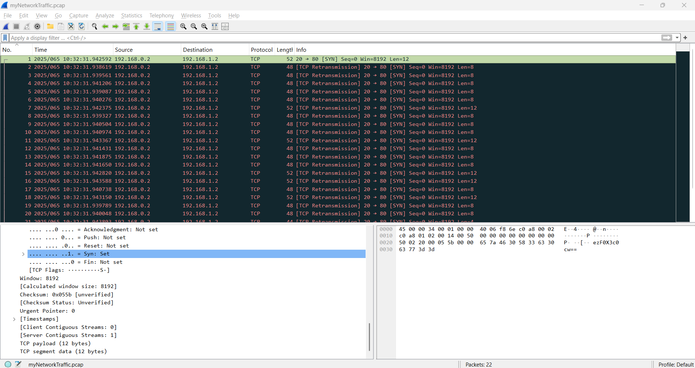

# Ph4t0m 1ntrud3r

### Description:

A digital ghost has breached my defenses, and my sensitive data has been stolen! 😱💻 Your mission is to uncover how this phantom intruder infiltrated my system and retrieve the hidden flag.
To solve this challenge, you'll need to analyze the provided PCAP file and track down the attack method. The attacker has cleverly concealed his moves in well timely manner. Dive into the network traffic, apply the right filters and show off your forensic prowess and unmask the digital intruder!
Find the PCAP file `here` Network Traffic PCAP file and try to get the flag.

### Commands / Steps:

Step 1: Download the pcap file.

Step 2: We use 'wireshark' to analyze the pcap file.

Step 3: There are only 22 packages to analyze so let's check the packages' raw packet data to look for anything suspicious.

Step 4: If we look at the raw data of the first package, we can see a suspicious string that looks like base64 encoded. We will try to encode through terminal or use cyberchef. 
Raw data from the packet: ezF0X3c0cw==
Decoded string: _w4snt_t

Step 5: What I suspected was right, so let's check that packet's length and information so that we can try filtering the packets to get the same raw datas. (I filtered by 'frame.len == 52')

Step 6: Retrieve all the base64 encoded strings from those packets after filtering and then sort by time so that we can get the flag in order.
cGljb0NURg== \
ezF0X3c0cw== \
bnRfdGg0dA== \
XzM0c3lfdA== \
YmhfNHJfZA== \
MTA2NTM4NA== --> \
Decoded string: picoCTF{1t_w4snt_th4t_34sy_tbh_4r_d1065384

Step 7: It looks like we still need the last part of the flag. If we look at the length of the packets, there's one single packet that only has the length of '44' while the others are 48 and 53. So we'll retrieve the base64 encoded string from there and add it to the previous strings to get the full flag.

### Flag:

> picoCTF{1t_w4snt_th4t_34sy_tbh_4r_d1065384}

### Notes / Tips

- Filter by packet length to find suspicious data
- Base64 strings were split across multiple packets
- Sort by time to reconstruct the flag in correct order
- Look for unusual packet sizes - the closing } was in a different length packet
- Tools: Wireshark filters + base64 decoding

